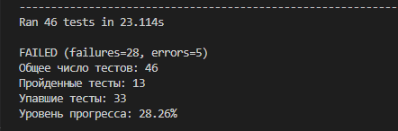

# python_course_for_teachers
## Задачи для курса


Добро пожаловать на курс Python для учителей! Этот репозиторий содержит задачи для участников курса, рассортированные по папкам с уроками. Каждая папка урока содержит задачи, которые необходимо решить, и тесты для проверки решений.

## Структура проекта

Проект организован по урокам, и каждый урок имеет свою папку. В каждой папке урока находятся несколько задач, каждая из которых представлена двумя файлами:

- `solution.py`: файл, в который участники должны записать свое решение задачи.
- `tests.py`: файл с тестами, которые проверяют правильность решения.

### Пример структуры папок
---

## Инструкции по решению задач

1. Перейдите в папку с задачей, которую вы хотите решить (например, `lesson_1/task_A`).
2. Откройте файл `solution.py` и напишите свое решение.
3. Сохраните изменения в файле `solution.py`.

## Инструкции по тестированию решений

1. Убедитесь, что вы находитесь в папке с соответствующей задачей
2. Запустите файл tests.py. Если решение верное - в терминале будет выведено OK. В противном случае - отчет о падении тестов.

## Отчет об общем прогрессе курса
1. Убедитесь, что вы находитесь в корневой директории проекта.
2. Запустите скрипт `main.py`, который выполнит все тесты в проекте и покажет процент успешных решений.

```bash
    python main.py
```


### Интерпретация результатов тестов
После выполнения тестов вы увидите следующую информацию:

- Total tests run: Общее количество выполненных тестов.
- Passed tests: Количество успешно пройденных тестов.
- Failed tests: Количество тестов, которые завершились с ошибкой.
- Success rate: Процент успешных тестов.
## Советы по решению задач
Внимательно читайте условия задачи, чтобы понять, что требуется.
Используйте комментарии в коде, чтобы объяснить свои решения.
Если вы застряли, попробуйте разбить задачу на более мелкие части и решать их поочередно.
## Обратная связь
Если у вас есть вопросы или предложения по улучшению проекта, пожалуйста, свяжитесь с разработчиком wiltort21@gmail.com.
Мы надеемся, что этот проект поможет вам улучшить свои навыки программирования на Python. Удачи!

## Разработчик:
### Королев Виктор
- Email: wiltort21@gmail.com
- GitHub: github.com/Wiltort
